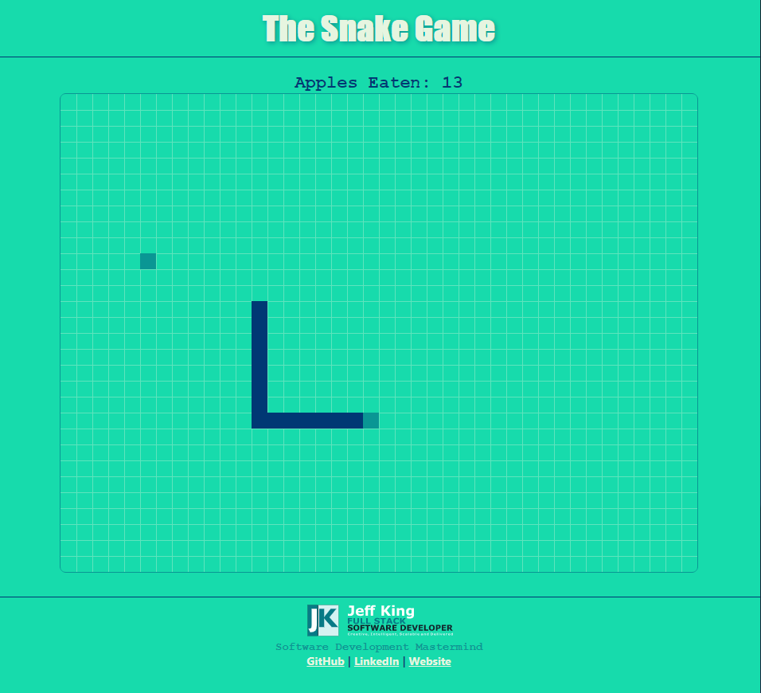
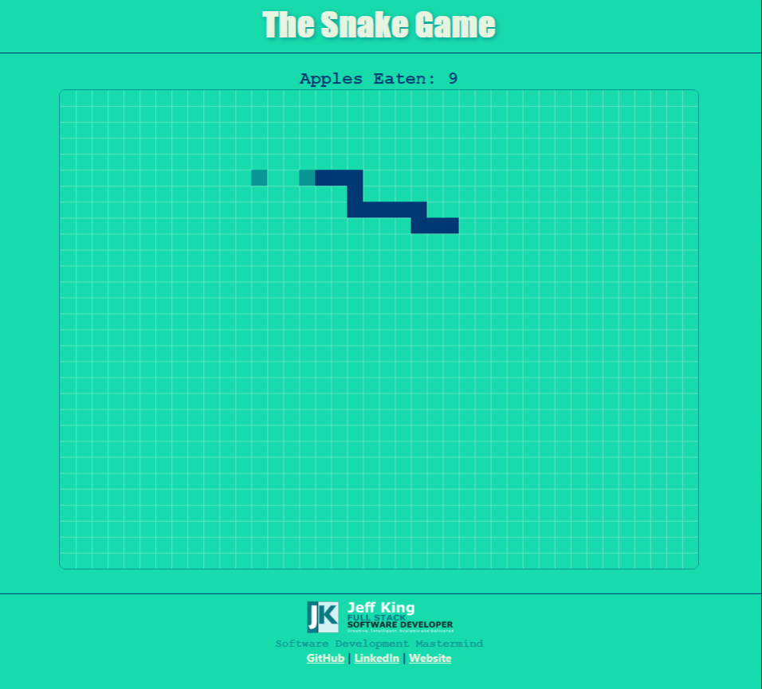
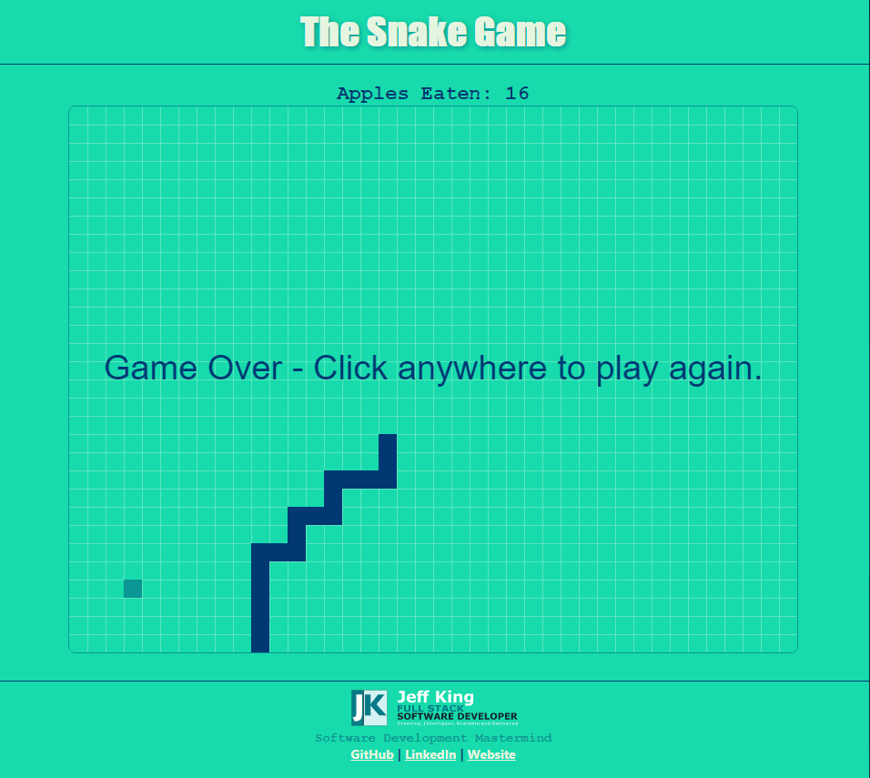

# JavaScript Snake Game
The classic Snake Game, written in pure (*"vanilla"*) JavaScript, HTML, and CSS.

## Links
[View Application](https://jazfunk.github.io/jk-snake-game/)  
[View Repository](https://github.com/jazfunk/jk-snake-game.git)

## Application Images
  
  
  

## Summary
What a challenge!  At the outset, developing this application was rather straight-forward.  Drawing shapes on an **HTML Canvas** object, moving those shapes, then redrawing in a *setInterval()* timer to depict movement was not a foreign concept.  As the game progressed, and complexity grew, implementing the advanced functions proved to be troublesome.

After resetting myself with a "work-free" weekend... and with some helpful hints, it was approached from a different perspective, and the logic was rebuilt.  By reducing the number of properties for each snake array segment down to the minimum necessary, and letting the other functions control the process, how to achieve the snake "zig-zag" movement became clear. 

Simply moving each segment to where the preceding one was located, and moving the snake head in the direction of the arrow key pressed, the snake "slithered" across the screen.  With significantly less code, might I add.  

Collision detection also came to fruition rapidly, and with very few *"headaches"*.  A simple comparison of the snake heads current position, game board boundaries, and the snake array, provides the path to end the game, and notify the user.

An enjoyable and rewarding learning experience, the snake game application taught me valuable new ways to set rules when converting logic into code, logically.

## Author
* **Jeff King** - *Full Stack Software Developer* - [GitHub](https://github.com/jazfunk) | [LinkedIn](https://www.linkedin.com/in/jeffking222/) | [Website](https://jeff-king.net)